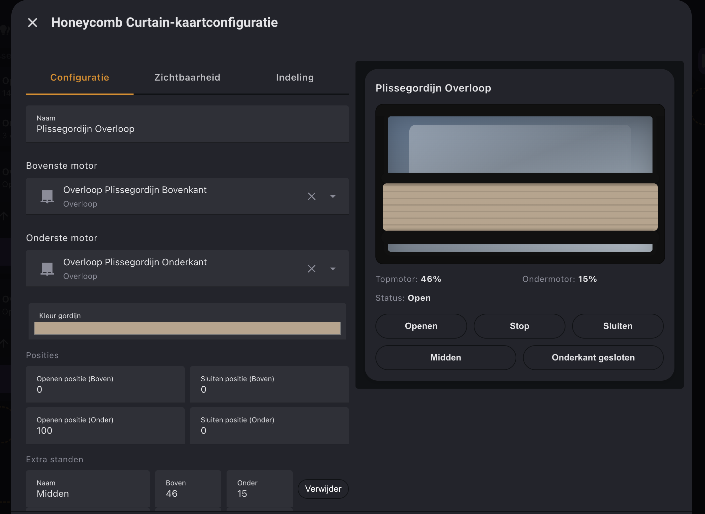

# Honeycomb Blinds Card

A Lovelace custom card to control a two-motor honeycomb blinds (top and bottom rails) in Home Assistant.

## Features
- Stylized honeycomb blinds in hazel taupe with black top box and black bottom rail, in a window frame.
- Shows current position of both motors and a visual status of the curtain.
- Tap the image to move the nearest rail (configurable).
- Buttons for Open, Stop, Close, plus optional extra presets.

## Installation (HACS)
1. Add this repository to HACS as a **Custom Repository** (type: **Dashboard**).
2. Install **Honeycomb Blinds Card**.
3. Add the card to your dashboard (GUI or YAML).

## Usage (YAML)
```yaml
type: custom:honeycomb-blinds-card
name: Honeycomb Blinds
cover_top: cover.top_motor
cover_bottom: cover.bottom_motor
```

## Options
- `name` (optional): Title shown above the card.
- `cover_top` (required): Entity id of the top motor cover.
- `cover_bottom` (required): Entity id of the bottom motor cover.
- `open_top` / `open_bottom` (optional): Positions for the **Open** button.
- `close_top` / `close_bottom` (optional): Positions for the **Close** button.
- `presets` (optional): Extra presets with `name`, `top`, `bottom`.
- `tap_action` (optional): Which rail to move when tapping the image.
  - `nearest` (default): Move the closest rail to the tap position.
  - `top`: Always move the top rail.
  - `bottom`: Always move the bottom rail.

## Behavior
- **Open** button uses `open_top`/`open_bottom`.
- **Stop** button sends `stop_cover` to both motors.
- **Close** button uses `close_top`/`close_bottom`.
- Extra presets can be added or removed in the card editor.

## Notes
- Home Assistant uses positions from `0` to `100`. This card assumes:
  - Top motor: `0 = fully up`, `100 = fully down`.
  - Bottom motor: `0 = fully down`, `100 = fully up`.

Default extra presets:
- `Middle`: top `46`, bottom `15`
- `Bottom closed`: top `46`, bottom `0`

## Preview


